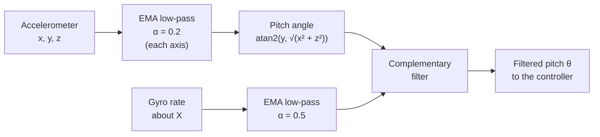

# Digital Filtering in Edmond

The robot balances by knowing its tilt angle, but neither tilt sensor is good enough on its own. The accelerometer gives a noisy angle that jumps around with every vibration. The gyroscope gives a smooth angular rate, but its angle slowly drifts. Two small digital filters clean this up:

| Filter | What it does | Where it is used |
|---|---|---|
| **EMA low-pass** (first-order IIR) | Smooths noisy readings | Each accelerometer axis (α = 0.2) and the gyro rate (α = 0.5) |
| **Complementary filter** | Blends the accelerometer angle and the gyro rate into one stable pitch | Final pitch estimate used by the controller |

## Contents

- [The pipeline](#the-pipeline)
- [1. EMA filter (first-order IIR)](#1-ema-filter-first-order-iir)
- [2. Complementary filter](#2-complementary-filter)
- [Trade-offs](#trade-offs)
- [Tuning tips](#tuning-tips)
- [References](#references)

---

## The pipeline



Pitch will represent the angle at the top of the robot's head relative to the horizontal.

---

## 1. EMA filter (first-order IIR)

<p align="center">
  
</p>

### The idea

An **exponential moving average (EMA)** keeps a running value and nudges it toward each new sample. Instead of storing the last 10 readings and averaging them, it only remembers **one number**, the previous output. That makes it cheap enough for a small microcontroller.

$$ y[n] = \alpha \, x[n] + (1 - \alpha) \, y[n-1] $$

- `x[n]` is the new sample and `y[n-1]` is the previous filtered output.
- `α` (alpha) between 0 and 1 sets how much you **trust the new sample**.

It is called a first-order **IIR** (infinite impulse response) filter because the output feeds back into itself. One delay element is all it needs.

### Choosing alpha

| α | Behavior | Result |
|---|---|---|
| Close to 1 | Mostly the new sample | Little smoothing, fast response |
| Close to 0 | Mostly the old output | Heavy smoothing, slow response |

For reference, if the filter runs every 40 ms, α = 0.2 gives a time constant of about 0.18 s, and α = 0.5 about 0.06 s. That is roughly how long the output takes to reach 63% of a sudden step.


### Code

```c
float digitalLowPassFilter(float input, float alpha, float *state) {
    // y = alpha * x + (1 - alpha) * y_prev
    *state = alpha * input + (1.0f - alpha) * (*state);
    return *state;
}
```

The `state` pointer holds the previous output. **Each signal needs its own state variable.** The three accelerometer axes use three separate states, so one axis can never overwrite another's history.

### How it is applied to the accelerometer

Each raw axis is filtered, and then the pitch angle is calculated from the filtered values:

```c
float alpha = 0.2f;

static float lpfStateXAccel = 0.0f;
static float lpfStateYAccel = 0.0f;
static float lpfStateZAccel = 0.0f;

x_accelLSBF = digitalLowPassFilter(x_accelLSB, alpha, &lpfStateXAccel);
y_accelLSBF = digitalLowPassFilter(y_accelLSB, alpha, &lpfStateYAccel);
z_accelLSBF = digitalLowPassFilter(z_accelLSB, alpha, &lpfStateZAccel);

anglePitchFiltered = atan2(y_accelLSBF,
                           sqrt(x_accelLSBF * x_accelLSBF + z_accelLSBF * z_accelLSBF))
                     * (180 / M_PI);
```

The full function, including the I2C reads and error handling, is in [`firmware/Core/Src/mpu6050.c`](../firmware/Core/Src).

### Result

The plot compares the unfiltered pitch from the accelerometer (**pink**) with the filtered pitch at α = 0.2 (**green**). The filtered trace is visibly smoother, with a small lag behind the raw one.

<p align="center">
  
</p>

---

## 2. Complementary filter

<p align="center">
  
</p>

### The problem

| Sensor | Good at | Bad at |
|---|---|---|
| Accelerometer angle | Long-term accuracy. Gravity always points down. | Noisy. Vibration and acceleration corrupt it. |
| Gyroscope (integrated) | Short-term accuracy. Smooth and responsive. | **Drift.** Small errors add up over time. |

Each one is strong where the other is weak, which is why they are called *complementary*.

### The idea

Use the gyro for fast changes and let the accelerometer slowly pull the result back toward the true angle:

$$ \theta[n] = \alpha \left( \theta[n-1] + \omega \cdot \Delta t \right) + (1 - \alpha) \, \theta_{\text{accel}} $$

- `θ[n-1] + ω·Δt` is the previous angle plus the gyro's rotation since the last step.
- `θ_accel` is the pitch from the accelerometer.
- `α` is usually close to 1 (for example 0.95 to 0.99), so the **gyro dominates** over short times and the accelerometer corrects the drift over longer times.

> **Watch the meaning of alpha.** In the EMA filter, α weights the **new sample**. In the complementary filter, α weights the **gyro**. They are different filters with opposite conventions, so values are not interchangeable.

Edmond uses the complementary alpha of 0.95.

### Code

```c
float compFilter(float anglePitch, float gyroAngularRate, float alpha) {
    static float    compFilterOutput = 0.0f;
    static uint32_t getTickOld       = 0;
    static uint8_t  firstRun         = 1;

    uint32_t currentTick = HAL_GetTick();
    float dt;

    if (firstRun) {            // no previous tick yet, so don't integrate
        dt = 0.0f;
        firstRun = 0;
    } else {
        dt = (currentTick - getTickOld) / 1000.0f;   // seconds
        if (dt > 0.05f) dt = 0.05f;                  // ignore long gaps
    }
    getTickOld = currentTick;

    compFilterOutput = alpha * (compFilterOutput + gyroAngularRate * dt)
                     + (1.0f - alpha) * anglePitch;

    return compFilterOutput;
}
```

Two small guards matter in practice:

- **First call.** Without it, `dt` is computed from a tick counter that starts at 0, so the first integration step is huge and the angle starts far from zero.
- **`dt` clamp.** If the loop stalls (an I2C retry, for example), a long `dt` would add a large jump to the angle.

---

## Trade-offs

Every filter adds **delay**. The more smoothing, the further the filtered value lags behind the real motion. For a balancing robot, that lag works against the controller, which needs to react quickly to tilt.

How much delay is acceptable depends on the control loop speed and how the sensor data is read and passed along. For Edmond, the lag is small enough that the robot balances. A faster or more demanding system would need the filters tuned for its specific case, for example by optimizing them in MATLAB.

Edmond's choice is also deliberately simple: two light filters that need almost no memory or computing time on the STM32.

## Tuning tips

1. **Change one alpha at a time** and compare the plots against the unfiltered signal.
2. **Too much smoothing** shows up as slow recovery and oscillation. **Too little** shows up as jitter in the motors.
3. **Stack filters carefully.** The accelerometer here is smoothed by the EMA *and* then the complementary filter, which also low-passes it. If the response feels sluggish, try less smoothing on the accelerometer first.
4. **Seed the EMA state** with the first sample, not 0, to avoid a short ramp-up at startup.

## References

- Phil's Lab, [*The Simplest Digital Filter (STM32 Implementation), Phil's Lab #92*](https://www.youtube.com/watch?v=1e_ZB8p5n6s)
- Phil's Lab, [*Complementary Filter - Sensor Fusion #2, Phil's Lab #34*](https://www.youtube.com/watch?v=BUW2OdAtzBw&xstg=CAMSEBUJ_b-oH-PhF0yjBgaukzY%3D)
- Phil's Lab, [*IIR Filters - Theory and Implementation (STM32), Phil's Lab #32*](https://www.youtube.com/watch?v=QRMe02kzVkA&xstg=CAMSEBUJ_b-oH-PhF0yjBgaukzY%3D)

